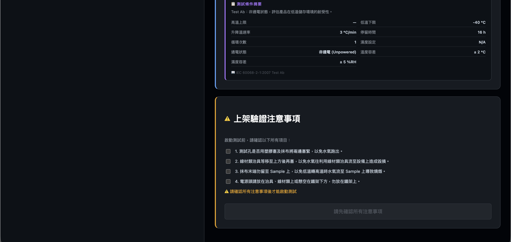
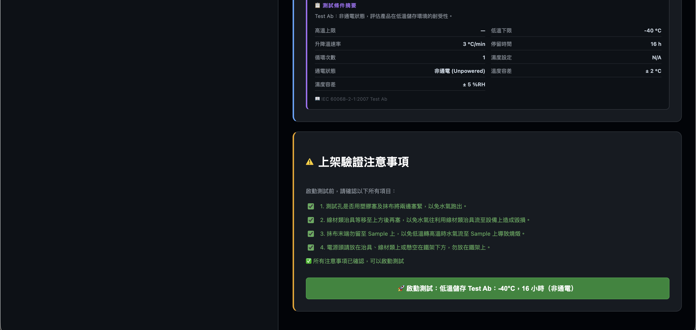
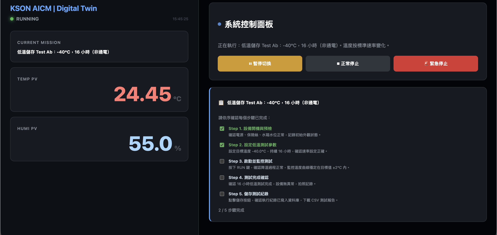
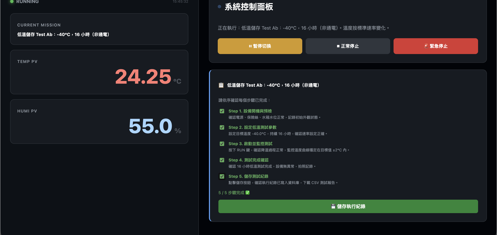
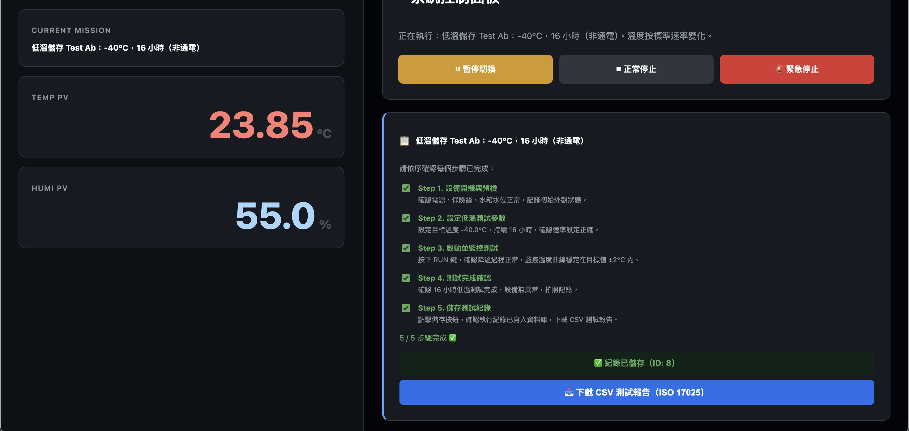
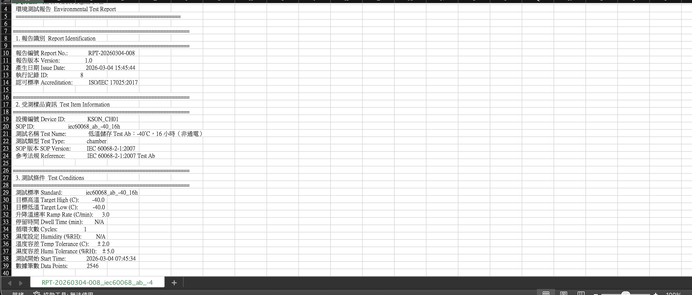

# DQA Lab Digital Twin


基於 FastAPI + React 的實驗室數位孿生平台，整合物理模擬引擎與國際環境測試標準，實現溫箱設備的遠端自動化控制。

## 專案背景

工業環境測試需要人工對照多份國際標準、手動紀錄溫濕度數據，過程繁瑣且容易出錯。本專案將測試流程數位化，整合 6 大國際標準的 62 個測試條件，並透過物理模擬引擎提供硬體不在場時的開發與測試環境。

## 核心功能

- **三步驟法規選擇** — 法規 → 版本/Class → 測試條件，6 大法規、62 個官方測試條件，動態載入
- **物理模擬引擎** — 即時升降溫斜率模擬，遵守各標準速率限制，每 10 秒寫 DB，自動清理 7 天舊數據
- **SOP 動態管理** — 依測試類型自動生成客制化步驟，Step 1、2 啟動自動勾選
- **狀態自動切換** — 待機/執行中畫面自動切換，暫停切換、正常停止、緊急停止邏輯完整
- **ISO 17025 測試報告** — 7 節格式，PASS/FAIL 自動判定，big5 編碼 Excel 相容
- **上架安全確認** — 啟動前強制確認四項注意事項，全勾才能啟動

## 系統截圖

| 三步驟選擇標準 | 安全確認（鎖定） | 安全確認（就緒） |
|:---:|:---:|:---:|
|  |  |  |

| 測試執行中 | 步驟完成 | 儲存並下載報告 |
|:---:|:---:|:---:|
|  |  |  |

### ISO 17025 CSV 報告輸出


## 支持的環境測試標準（62 個測試條件）

| 法規 | 版本 | 測試數 | 主要測試項目 |
|------|------|---------|------------|
| **IEC 60068** | 2-1 / 2-2 / 2-14 / 2-30 | 12 | 冷測 Ab/Ad、乾熱 Ba/Bb、溫度循環/熱衝擊 Na/Nb、濕熱循環 Db |
| **EN 50155** | 2017 / 2007 | 18 | OT1~OT6 高溫/低溫、ST1 開機延伸、隧道快速溫變、濕熱循環 |
| **IEC 61850-3** | Ed.2:2013 / Ed.1:2002 | 9 | Class C1/C2/C3 各自乾熱+冷測+濕熱 |
| **DNV** | CG-0339:2019 / Std.Cert.2.4 | 12 | Class A/B/C/D，C/D 冷測強制，穩態/循環濕熱 |
| **KEMA** | KEMA KEUR | 4 | 乾熱、冷測、濕熱穩態、溫度循環 |
| **NMEA** | IEC 61162-1 / 61162-3 | 7 | 受保護/暴露裝置，NMEA 0183/2000 |

## 快速啟動

```bash
# 安裝依賴
pip install -r backend/requirements.txt
npm install --prefix client

# 一鍵啟動
make dev
```

啟動後開啟 `http://localhost:5173/sop`，選擇法規與測試條件後啟動測試。

## API 端點

| 方法 | 路徑 | 說明 |
|------|------|------|
| GET  | `/api/latest` | 即時溫濕度與狀態 |
| GET  | `/api/sop/` | SOP 列表 |
| GET  | `/api/sop/standards/tree` | 三層標準樹（法規→版本→測試條件） |
| POST | `/api/sop/start` | 啟動 SOP |
| POST | `/api/sop-executions/` | 儲存執行紀錄 |
| GET  | `/api/sop-executions/{id}` | 讀取執行紀錄 |
| GET  | `/api/reports/csv/{id}` | 下載 ISO 17025 CSV 測試報告 |
| GET  | `/api/reports/list` | 所有執行紀錄列表 |
| POST | `/api/stop/emergency` | 緊急停止 |
| POST | `/api/stop/pause` | 暫停切換（RUNNING ↔ PAUSED） |
| POST | `/api/stop/normal` | 正常停止（自動降溫回 IDLE） |

互動式 API 文件：`http://localhost:8000/docs`

## 技術堆棧

後端：FastAPI、Pydantic、SQLAlchemy、asyncio、SQLite
前端：React 18、Vite、Recharts、Axios
環境：Python 3.9+、Node.js 16+、macOS/Linux（需要 socat）

## 延伸文件

- [系統架構與開發進度](./docs/architecture.md)
- [更新紀錄](./CHANGELOG.md)
- [QA 測試報告模板](./docs/templates/QA_Test_Report_Template.docx)

## 授權

MIT License