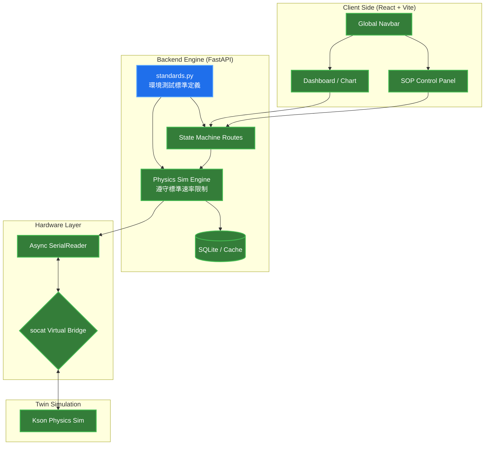

# DQA Lab Digital Twin

這是一個基於 Python FastAPI 與 React 的實驗室數位孿生平台。本專案不只是數據採集，更結合了物理模擬引擎，實現了實驗室設備（如慶聲溫箱）的完整數位轉型與遠端自動化控制邏輯。

本平台支持**國際環境測試標準**（EN50155、IEC60068、IEC60954、IEC61850、KEMA、NEMA），能精準模擬標準升降溫速率，確保測試符合法規要求。

## 🌟 核心功能

- **✅ 工業級控制面板**: 實作「緊急停止」、「暫停切換」、「正常結束」三鍵邏輯，具備即時 Pulse 動畫提醒。
- **✅ 物理模擬引擎**: 具備即時升降溫斜率模擬 (Temperature Slew Rate) 與數值震盪演算法，**遵守國際標準升降溫速率限制**。
- **✅ 環境測試標準整合**: 支持 EN50155、IEC60068-2-14/2-30、NEMA、KEMA 等測試標準，自動限制升降溫速率。
- **✅ SOP 動態管理**: 從 `standards.py` 動態載入測試流程，支持標準參數與自訂步驟。
- **✅ 解耦導航架構**: 全域唯一的路由控制，優化 React 渲染效能並消除冗餘 UI。
- **✅ 異步通訊架構**: 採用 FastAPI 多執行緒處理，確保數據採集與 API 回應互不干擾。
- **✅ 自動化開發環境**: 透過 `Makefile` 一鍵啟動虛擬串口、模擬器、後端與前端。

## 📋 支持的環境測試標準

| 標準 | 測試名稱 | 溫度範圍 | 速率限制 | 應用場景 |
|------|---------|---------|---------|---------|
| **EN50155** | 高/低溫儲存 | -40 ~ +70°C | 5°C/min | 歐洲鐵路設備 |
| **IEC60068-2-14** | 溫度循環 | -40 ~ +85°C | 2°C/min | 工業電子設備 |
| **IEC60068-2-30** | 濕熱循環 | 25 ~ 55°C | 2°C/min | 濕熱環境測試 |
| **NEMA** | 溫度循環 | -30 ~ +70°C | 1°C/min | 美國電氣設備 |
| **KEMA** | 環境應力 | -25 ~ +70°C | 2°C/min | 歐洲能源認證 |

## 🏗️ 系統架構


## 📂 專案目錄結構

本專案採用解耦架構，實體檔案與架構圖模組對應如下：
```text
.
├── backend                 # FastAPI 核心
│   ├── app
│   │   ├── main.py         # 狀態機路由與物理模擬邏輯
│   │   ├── sop.py          # SOP 管理路由
│   │   ├── standards.py    # 環境測試標準定義 ⭐ NEW
│   │   ├── models.py       # 資料模型定義
│   │   ├── serial_reader.py# 異步串口監聽服務
│   │   └── init_db.py      # 資料庫初始化
│   ├── requirements.txt    # Python 依賴
│   └── test.db             # SQLite 資料庫
├── client                  # React 前端介面
│   ├── src
│   │   ├── App.jsx         # 全域導航列與路由控制中心
│   │   ├── Dashboard.jsx   # 儀表板頁面 (即時數據)
│   │   ├── SOPPage.jsx     # SOP 執行頁面 (40/60 雙欄佈局)
│   │   ├── SOPPage.css     # 專屬樣式 (含 Pulse 動畫)
│   │   └── index.css       # 全域樣式
│   ├── package.json
│   └── vite.config.js
├── Makefile                # 自動化控制指令集
├── dev_start.sh            # 系統啟動腳本 (含日誌過濾)
└── README.md               # 專案首頁
```

## 🛠️ 快速啟動
```bash
# 1. 依賴安裝
pip install -r backend/requirements.txt
npm install --prefix client

# 2. 初始化資料庫
python backend/app/init_db.py

# 3. 一鍵啟動
# 自動建立虛擬串口、啟動後端 API (隱藏輪詢日誌)、前端與模擬器
make dev

# 💡 提示: 
# 啟動後 API 輪詢日誌已過濾。
# 如需查看底層虛擬串口連線細節，請執行:
make logs

# 4. 深度清理
# 結束開發時，請務必執行以釋放串口與連線埠
make clean
```

## 🧪 環境測試流程

### 支持的測試類型

1. **溫度循環測試** (IEC60068-2-14)
   - 溫度範圍: -40°C ~ +85°C
   - 升降溫速率: 2°C/分鐘（自動限制）
   - 循環次數: 5 個

2. **EN50155 高溫儲存**
   - 測試溫度: 70°C
   - 升溫速率: 5°C/分鐘（自動限制）
   - 持續時間: 16 小時

3. **EN50155 低溫儲存**
   - 測試溫度: -40°C
   - 降溫速率: 5°C/分鐘（自動限制）
   - 持續時間: 16 小時

4. **濕熱循環測試** (IEC60068-2-30)
   - 溫度範圍: 25°C ~ 55°C
   - 濕度: 95% RH
   - 循環次數: 6 個

### 使用流程
```bash
1. 打開網頁: http://localhost:5173/sop
2. 選擇測試程序 (右側 SOP List)
3. 點擊「啟動測試程序」按鈕
4. 溫度將按照標準規定的速率自動變化
5. 點擊「正常停止」完成測試，溫度自動回到 25°C
```

## 📊 API 端點

### SOP 管理
- `GET /api/sop/` - 獲取所有可用的 SOP 列表
- `POST /api/sop/start` - 啟動指定的 SOP 測試

### 設備控制
- `GET /api/latest` - 獲取最新設備狀態 (溫度、濕度、狀態)
- `POST /api/stop/emergency` - 緊急停止
- `POST /api/stop/pause` - 暫停測試
- `POST /api/stop/normal` - 正常停止（自動降溫）

## 🔧 技術堆棧

### 後端
- **FastAPI** - 非同步 Web 框架
- **SQLAlchemy** - ORM 資料庫管理
- **asyncio** - 非同步任務處理
- **pyserial** - 串口通訊

### 前端
- **React 18** - UI 框架
- **Vite** - 快速開發工具
- **Recharts** - 圖表繪製
- **Axios** - HTTP 客戶端

### 環境
- **Python 3.9+**
- **Node.js 16+**
- **macOS/Linux** (需要 socat)

## 📁 延伸文件
- [系統完整架構細節](./docs/architecture.md) - 記錄所有模組開發進度與未來待辦事項
- [環境測試標準定義](./backend/app/standards.py) - 支持的國際標準參數

## 📝 最近更新 (2026-03-02)

- ✅ 整合 EN50155、IEC60068 等環境測試標準
- ✅ 實現標準升降溫速率限制
- ✅ 動態 SOP 管理系統
- ✅ 數據庫初始化流程
- ✅ 前端 SOP 列表動態載入

## 🤝 貢獻指南

歡迎提交 Issue 和 Pull Request！

## 📄 授權

MIT License