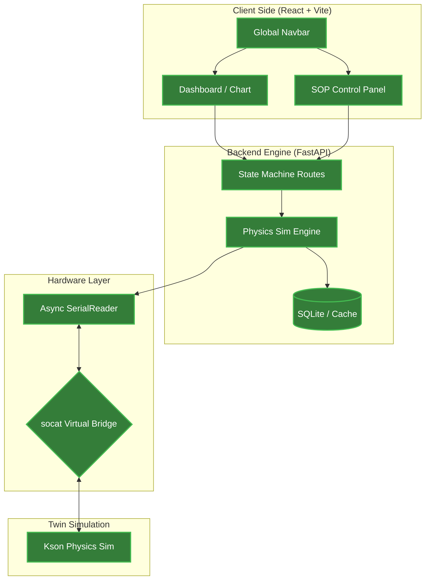

# DQA Lab Digital Twin

這是一個基於 Python FastAPI 與 React 的實驗室數位孿生平台。本專案不只是數據採集，更結合了物理模擬引擎，實現了實驗室設備（如慶聲溫箱）的完整數位轉型與遠端自動化控制邏輯。

## 🌟 核心功能

- **✅ 工業級控制面板**: 實作「緊急停止」、「暫停切換」、「正常結束」三鍵邏輯，具備即時 Pulse 動畫提醒。
- **✅ 物理模擬引擎**: 具備即時升降溫斜率模擬 (Temperature Slew Rate) 與數值震盪演算法，精準模擬物理行為。
- **✅ 解耦導航架構**: 全域唯一的路由控制，優化 React 渲染效能並消除冗餘 UI。
- **✅ 異步通訊架構**: 採用 FastAPI 多執行緒處理，確保數據採集與 API 回應互不干擾。
- **✅ 自動化開發環境**: 透過 `Makefile` 一鍵啟動虛擬串口、模擬器、後端與前端。

## 🏗️ 系統架構





## 📂 專案目錄結構

本專案採用解耦架構，實體檔案與架構圖模組對應如下：

```text
.
├── backend                 # FastAPI 核心
│   ├── app
│   │   ├── main.py         # 狀態機路由與物理模擬邏輯
│   │   └── serial_reader.py# 異步串口監聽服務
├── client                  # React 前端介面
│   ├── src
│   │   ├── App.jsx         # 全域導航列與路由控制中心
│   │   ├── SOPPage.jsx     # SOP 執行頁面 (40/60 雙欄佈局)
│   │   └── SOPPage.css     # 專屬樣式 (含 Pulse 動畫)
├── simulator               # 硬體模擬層
│   └── main.py             # 慶聲溫箱 (Kson) 物理行為模擬腳本
├── Makefile                # 自動化控制指令集
├── dev_start.sh            # 系統啟動腳本 (含日誌過濾)
└── README.md               # 專案首頁

```

## 🛠️ 快速啟動

```bash

# 1. 依賴安裝
make install

# 2. 環境變數設定 (必要步驟)
# 複製範例設定檔，用於定義 API 埠號或資料庫路徑
cp .env.example .env

# 3. 一鍵啟動
# 自動建立虛擬串口、啟動後端 API (隱藏輪詢日誌)、前端與模擬器
make dev

# 💡 提示: 
# 啟動後 API 輪詢日誌已過濾。
# 如需查看底層虛擬串口連線細節，請執行:
make logs

# 4. 深度清理
# 結束開發時，請務必執行以釋放串口與連線埠
make clean

```

## 📁 延伸文件
- [系統完整架構細節](./architecture.md) (記錄所有模組開發進度與未來待辦事項)
