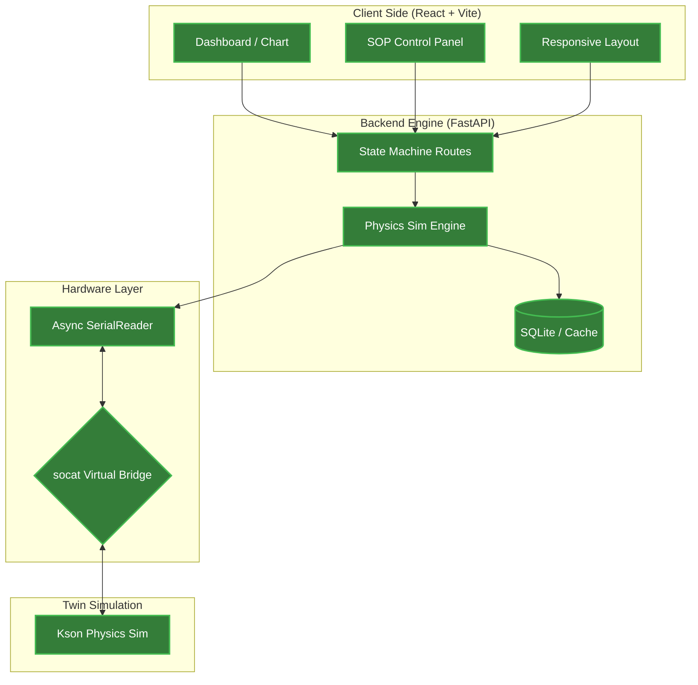

# DQA Lab Digital Twin

這是一個基於 Python FastAPI 與 React 的實驗室數位孿生平台。本專案不只是數據採集，更結合了物理模擬引擎，實現了實驗室設備（如溫箱）的完整數位轉型與遠端自動化控制邏輯。

## 🌟 核心功能

- **✅ 工業級控制面板**: 實作「緊急停止」、「暫停切換」、「正常結束」三種狀態控制邏輯，符合真實實驗室操作安全規範。
- **✅ 物理模擬引擎**: 具備即時升降溫斜率模擬 (Temperature Slew Rate) 與數值震盪演算法，精準模擬溫箱物理行為。
- **✅ 異步通訊架構**: 採用 FastAPI 多執行緒異步處理，確保串口數據採集 (SerialReader) 與 API 回應互不干擾。
- **✅ 響應式監控介面**: 使用 Vite + React 建構，具備 Auto-Layout 功能，支援多平台視窗比例監控。
- **✅ 自動化開發環境**: 透過 `Makefile` 一鍵啟動虛擬串口橋接 (`socat`)、物理模擬器、API 與前端。

## 🏗️ 系統架構

本專案採用解耦架構，將硬體通訊層、模擬引擎層與業務邏輯層分離。




## 📂 專案目錄結構

本專案採用解耦架構，實體檔案與架構圖模組對應如下：

```text
.
├── backend                 # 【Backend Engine】FastAPI 核心
│   ├── app
│   │   ├── main.py         # 狀態機路由 (State Machine) 與物理模擬邏輯
│   │   ├── models.py       # SQLite 資料結構定義 (SQLAlchemy)
│   │   └── serial_reader.py# 【Hardware Layer】異步串口監聽服務 (Async)
│   ├── init_db.py          # 資料庫初始化工具
│   └── test.db             # 實體 SQLite 資料庫 (存放歷史數據與 SOP)
├── client                  # 【Client Side】React 前端介面
│   ├── src
│   │   ├── SOPPage.jsx     # 【SOP Control Panel】三鍵控制與程序執行
│   │   ├── Dashboard.jsx   # 【Dashboard / Chart】數據儀表板與趨勢圖
│   │   └── main.jsx        # 前端進入點
│   └── vite.config.js      # Vite 配置環境
├── simulator               # 【Twin Simulation】硬體模擬層
│   └── main.py             # 慶聲溫箱 (Kson) 物理行為模擬腳本
├── docs                    # 專案文件管理
│   └── architecture.md     # 詳細開發進度與未來架構藍圖
├── Makefile                # 【socat Bridge】一鍵自動化啟動腳本
└── README.md               # 專案首頁說明文件

```

## 🛠️ 快速啟動

```bash

# 1. 初始化環境:第一次執行請安裝依賴並設定環境變數
make install

# 2. 環境變數設定:
# 複製設定檔並命名為 .env
cp .env.example .env

# 3. 一鍵啟動開發服務:
# 自動建立虛擬串口、啟動後端 API、前端與模擬器

make dev

# 4. 停止與清理:
# 結束開發後，按一下 Ctrl + C 即可停止。若需清理殘留程序，請執行:
make clean

```

## 📁 延伸文件
- [系統完整架構細節](./architecture.md) (記錄所有模組開發進度與未來待辦事項)
